<div align="center">
  
</div>

<div align="center">
  <a href="https://github.com/Papa-het?tab=repositories"></a>
  <a href="https://x.com/papahet01"></a>
  <a href="https://github.com/Papa-het?tab=followers"></a>
</div>

<br />

## `01. profile`

I'm a software engineer based in **Almaty, Kazakhstan**, currently building at **Technodom**. I enjoy turning ambiguous ideas into clean, dependable products—from TypeScript frontends and backend services to Go utilities and developer-friendly templates.

```ts
const yerkin = {
  location: "Almaty, Kazakhstan",
  role: "Software Engineer",
  focus: ["web platforms", "backend systems", "developer experience"],
  currentlyExploring: ["Go", "Raspberry Pi", "cloud architecture"],
  philosophy: "Make it useful. Make it clear. Keep learning.",
} as const;
```

## `02. toolkit`

<div align="center">
  
</div>

## `03. selected builds`

<table>
  <tr>
    <td width="50%" valign="top">
      <h3>🔔 Raspy3 Notificator</h3>
      <p>An authenticated Go webhook service that turns payment events into audio notifications on a Raspberry Pi—complete with provider-specific sounds and Almaty working-hour rules.</p>
      <p><code>Go</code> <code>Raspberry Pi</code> <code>Webhooks</code></p>
      <a href="https://github.com/Papa-het/raspy3-notificator"><strong>Explore the project →</strong></a>
    </td>
    <td width="50%" valign="top">
      <h3>⚛️ Practice for Students</h3>
      <p>A lightweight React, TypeScript, and Vite workspace for students practicing modern frontend development with fast feedback and a clean starting point.</p>
      <p><code>React</code> <code>TypeScript</code> <code>Vite</code></p>
      <a href="https://github.com/Papa-het/practice-for-students"><strong>Explore the project →</strong></a>
    </td>
  </tr>
  <tr>
    <td width="50%" valign="top">
      <h3>🧠 Algostruct</h3>
      <p>A growing C++ collection of algorithms, data structures, interview patterns, and carefully curated learning resources.</p>
      <p><code>C++</code> <code>Algorithms</code> <code>Data Structures</code></p>
      <a href="https://github.com/Papa-het/algostruct"><strong>Explore the project →</strong></a>
    </td>
    <td width="50%" valign="top">
      <h3>🐳 Next.js Docker Template</h3>
      <p>A practical starter for shipping Next.js and TypeScript applications in consistent, containerized environments.</p>
      <p><code>Next.js</code> <code>TypeScript</code> <code>Docker</code></p>
      <a href="https://github.com/Papa-het/nextjs-ts-docker-template"><strong>Explore the project →</strong></a>
    </td>
  </tr>
</table>

## `04. open-source signal`

<div align="center">
  
  
  <br />
  
  <br />
  
</div>

## `05. let's build`

I’m always interested in thoughtful products, ambitious technical problems, and conversations with people who care about their craft.

<div align="center">
  <a href="https://github.com/Papa-het?tab=repositories"><strong>See what I'm building</strong></a>
  &nbsp;·&nbsp;
  <a href="https://x.com/papahet01"><strong>Say hello</strong></a>
</div>

<br />

<div align="center">
  <sub>Designed with curiosity, built one commit at a time.</sub>
</div>
